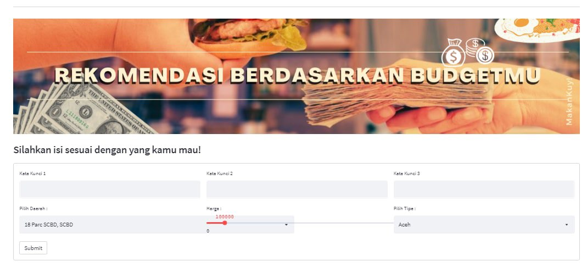
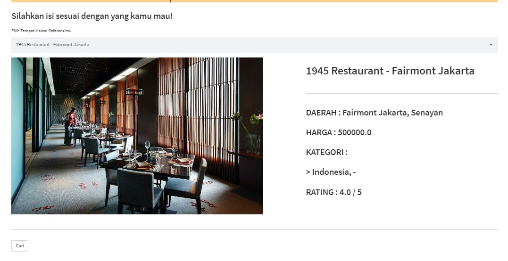

# MakanKuy!

  

**Makankuy!** adalah sebuah aplikasi pemesanan tempat makan terdekat, yang dapat memberikan rekomendasi berdasarkan suasana yang diinginkan oleh customer serta preferensi tempat makan yang telah diketahui customer.

## Latar Belakang

Tempat makan selain untuk memenuhi kebutuhan individu, juga menjadi sarana untuk bersosialisasi ataupun berinteraksi dengan individu lain, seperti berbincang dengan teman, meeting, dan hal lainnya. Berdasarkan hal tersebut, suasana dan fasilitas adalah faktor penting yang harus diperhatikan dalam pemilihan tempat makan sesuai dengan keinginan dari customer. 

MakanKuy hadir untuk mengatasi user yang bingung mencari tempat makan dan khawatir mengenai tempat makan yang diekspektasikan, karena hal tersebut kami merekomendasikan restoran berdasarkan review pelanggan yang pernah mengunjungi lokasi !

## Cara Menggunakan Aplikasi

  
  

  Tampilan dari laman beranda

---

Untuk menggunakan aplikasi cukup mudah, cukup ganti laman yang telah disediakan pada navigation menu untuk menuju ke skema 1 berdasarkan keyword dan beberapa data pilihan user, dan skema 2 yang merekomendasikan berdasarkan restoran preferensi user.

  
  

  Tampilan dari laman skema 1

---

  
  

  Tampilan dari laman skema 2

## Contributor
1. [Andreean Dharma Arisandi](https://github.com/Andreean99)
2. [Reynaldi Marchiano](https://github.com/reynaldimarchiano)
3. [Sanggeni Gali Wardhana](https://github.com/sanggeniwardhana)
4. [Teza Marlevi Fajar](https://github.com/tezamarlevi)
